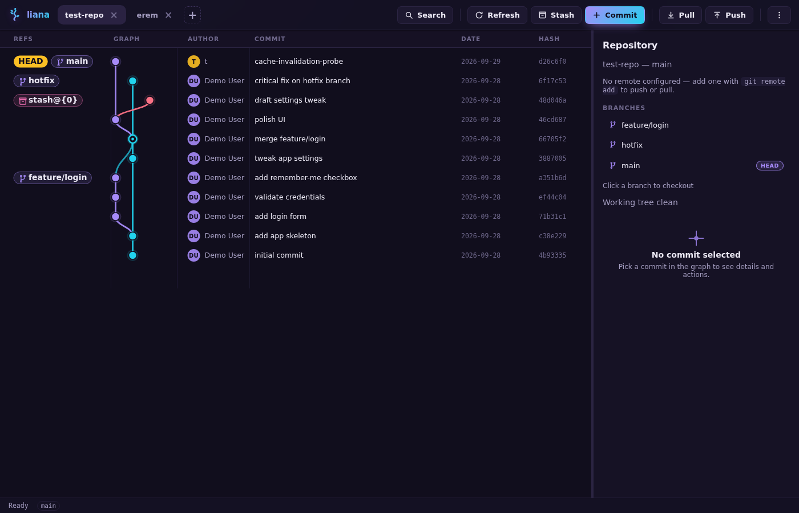

# Liana

A minimal git GUI: an interactive commit graph with **commit**, **rebase**, **cherry-pick**, and **revert**, integrated
**conflict resolution**, **submodules**, plus **push**, **pull**, and **login** for repositories that already live on
your machine. It also reviews open GitLab merge requests and GitHub pull requests with an OpenAI-compatible model,
proposing per-line comments you approve one by one, and can draft commit messages from the changes you're about to
commit. A per-file **Fix with AI** action merges a conflicted file. Clone, fetch, and remote management are deliberately
absent — this is a visual history surgeon, not a general forge client.

> ## Disclaimer
>
> Some git actions (force push, hard reset, branch/tag deletion, rebase, …)
> are **destructive**. Please be sure about what you are doing.



## Architecture

```
Renderer (lit-free vanilla TS + SVG)                Node
  │  fetch /api/*                                   │
  ├── browser dev ──► Vite dev server (dev.ts)      ┤
  └── Electron ─────► electron/server.ts            ┤
                        (127.0.0.1 loopback)        │
                                                    ▼
                                                    src/api/    ──► spawn `git …`
                                                    ▼
                                                    Your repository (working directory, on-disk refs)
```

The backend is `src/api/`: a transport-agnostic, Node-only package holding every git wrapper and `/api` route behind
`createApi(...).handle(route, method, body)` (`src/api/index.ts`). Git wrappers are split by concern — `exec.ts`,
`repo.ts`, `conflicts.ts`, `submodules.ts`, `diffs.ts`, `rebase.ts`, `branches.ts`, `remotes.ts`, `reset.ts`,
`stash.ts`, `operations.ts` — and re-exported from the barrel. Two thin adapters serve it — the Vite plugin for browser
dev, and a loopback HTTP server for the packaged Electron app. The renderer only ever speaks `fetch('/api/*')`.

- `src/api/index.ts` — Node-only backend entry: JSON route dispatch + repository registry, composing the wrapper
  modules below. Addresses repositories by opaque `x-liana-repo` ids.
- `src/api/*.ts` — git CLI wrappers grouped by functionality (`exec`, `repo`, `conflicts`, `submodules`, `diffs`,
  `rebase`, `branches`, `remotes`, `reset`, `stash`, `operations`).
- `dev.ts` — Vite plugin adapter; runs only under `vite dev`.
- `electron/main.ts` — main process: window, native folder dialog, git-on-PATH.
- `electron/server.ts` — packaged mode: loopback server (UI static files + `/api`).
- `electron/preload.ts` — `contextBridge` surface (`window.liana`).
- `src/git/` — browser-side mirror of the same wrappers (typed contract, kept in sync): a parallel
  `exec`/`repo`/`conflicts`/… split, re-exported from `src/git/index.ts`.
- `src/forge.ts` — the `ReviewForge` interface and shared forge git helpers.
- `src/forges.ts` — forge registry + per-repo selection (`resolveForge`).
- `src/gitlab.ts` / `src/github.ts` — the GitLab and GitHub REST clients.
- `src/layout.ts` — lane assignment (see below). Pure function, no DOM.
- `src/graph.ts` — SVG renderer: lanes as bezier curves, merge commits as rings, branch chips as rounded rects.
- `src/ui/` — renderer entry (`index.ts`) plus one module per feature (tabs, detail, diff/code viewers, conflicts,
  search, settings, review view, …). Cross-feature view state lives in `src/ui/store.ts`; each feature owns an
  `initX()` that binds its own DOM.
- `src/code.ts` — Monaco integration (diff + read-only viewer + editable conflict
  result). Dynamically imported on first use so the editor and its language workers
  stay out of the initial bundle; the UI keeps a hand-rolled HTML fallback for diffs.

### Lane algorithm (src/layout.ts)

Input: commits in `--date-order` (children never before parents). Each commit claims the lane previously reserved for
it, else the lowest free lane. First-parent edges continue straight in the child's lane; second-parent edges curve and
take a reserved or new lane. This is what produces the parallel vertical lanes.

## API

Multiple repositories can be open at once, one per UI tab. Every repo-scoped route requires an `x-liana-repo: <id>`
header naming a repository from `GET /api/repos` or `POST /api/open`; a missing or unknown id returns `400
{error:"Unknown repository"}`. The client sends the active tab's id on every request. Routes without the header are
`/api/repos` and `/api/open` (repo management).

| Route | Method | Body | Effect |
|---|---|---|---|
| `/api/repos` | GET | — | Repositories known to the server: `[{id, path, name}]` |
| `/api/open` | POST | `{path}` | Validate a local repo and register it (idempotent); returns `{id, path, name}` |
| `/api/state` | GET | — | Repo state, commits (date-order, first 500), status |
| `/api/activity` | GET | — | Git commands for this repo: `{running, last, active, history}` (running command, most recent user action, and the last 10 user commands) |
| `/api/commit` | POST | `{message, files[]}` | `git commit` of the listed paths; stages selected files and unstages already-staged files that aren't listed |
| `/api/commit-message` | POST | `{files[], providerId?}` | Draft a commit message for the listed working-tree paths with the active provider (read-only) |
| `/api/rebase` | POST | `{onto}` | Rebase current branch onto a branch or commit hash (409 if dirty) |
| `/api/merge` | POST | `{ref}` | Merge a branch or commit into the checked-out branch (`git merge --no-edit`, 409 if dirty) |
| `/api/rebase-start` | POST | `{onto}` | List commits `onto..HEAD` (oldest first) for an interactive rebase |
| `/api/rebase-execute` | POST | `{onto, items[]}` | Run the generated interactive-rebase todo |
| `/api/cherry-pick` | POST | `{ref, mainline?, record?}` | Cherry-pick a commit; `mainline` = `-m N`, `record` = `-x` (409 if dirty) |
| `/api/revert` | POST | `{ref, mainline?}` | Revert a commit (`git revert --no-edit`); `mainline` = `-m N` (409 if dirty) |
| `/api/commit-diff` | POST | `{hash}` | Changed files of a commit (`CommitFile[]`) for the commit detail pane |
| `/api/commit-file-diff` | POST | `{hash, path, oldPath?}` | Unified diff of one file in a commit (`oldPath` includes a rename source) |
| `/api/worktree-file-diff` | POST | `{path, oldPath?}` | Unified diff of a working-tree file against HEAD (staged + unstaged); untracked files diff against `/dev/null` |
| `/api/file-content` | POST | `{hash?, path, oldPath?}` | Original + modified text of one file (`hash` set → parent vs. commit; omitted → HEAD vs. working tree), for the Monaco diff and viewer. Missing sides are null; binary sides omit text |
| `/api/checkout` | POST | `{branch, remote?}` | Checkout a local branch; with `remote:true`, `branch` is a remote-tracking ref (`origin/feature`) and a local tracking branch is created/reused |
| `/api/branch-create` | POST | `{name, ref}` | Create `ref` and check out a branch (`git checkout -b`) |
| `/api/branch-delete` | POST | `{name, remote?}` | Delete a branch: local `-D`, or `push --delete` when `remote` |
| `/api/tag-create` | POST | `{name, ref}` | Create a lightweight tag at `ref` |
| `/api/tag-delete` | POST | `{name}` | Delete a tag (`git tag -d`) |
| `/api/reset` | POST | `{mode, ref}` | `git reset --soft\|--mixed\|--hard <ref>` on the checked-out branch |
| `/api/stash` | POST | `{message?, includeUntracked?}` | `git stash push` (`-u` when `includeUntracked`); `{stashed:false}` when clean |
| `/api/stash-apply` | POST | `{hash}` | `git stash apply` the stash identified by its WIP commit hash (keeps the entry) |
| `/api/stash-drop` | POST | `{hash}` | `git stash drop` the stash identified by its WIP commit hash |
| `/api/remote-status` | GET | — | Current branch, remotes, upstream, ahead/behind counts, credential helper |
| `/api/push` | POST | `{remote?, branch?, force?}` | Push the current branch; sets upstream with `-u` when it has none. `force` adds `--force-with-lease`. 400 without a remote |
| `/api/pull` | POST | `{remote?, branch?}` | `git pull` (merge); proceeds with local changes, git's error surfaced if they'd be overwritten |
| `/api/remote-test` | POST | `{remote}` | `git ls-remote` the remote to test connectivity/auth |
| `/api/conflicts` | GET | — | Unmerged paths (`git ls-files -u`) + in-progress operation state |
| `/api/conflict-file` | POST | `{path}` | Base / ours / theirs contents plus the working-tree file (conflict markers included) for one conflicted path |
| `/api/conflict-resolve` | POST | `{path, resolution}` | Resolve one path: `ours` / `theirs` (`git checkout --ours/--theirs` + `add`) or `resolved` (`add`) |
| `/api/conflict-save` | POST | `{path, content}` | Write the edited working-tree file (traversal-guarded) and `git add` it |
| `/api/conflict-fix` | POST | `{path, providerId?}` | AI-proposed merged file for one conflicted path (binary/submodule conflicts are rejected) |
| `/api/conflict-apply` | POST | `{path, kind, content}` | Write the **user-approved** AI merge to the working tree and stage it (`kind` = `content`\|`delete`) |
| `/api/conflict-continue` | POST | — | `git <rebase\|merge\|cherry-pick\|revert> --continue` (no editor) |
| `/api/conflict-abort` | POST | — | `git <op> --abort` |
| `/api/conflict-skip` | POST | — | `git <rebase\|cherry-pick\|revert> --skip` (not merge) |
| `/api/submodules` | GET | — | Configured submodules (`.gitmodules`) with their checked-out state |
| `/api/submodule-update` | POST | `{remote?, init?}` | `git submodule update [--init] [--remote]` (network) |
| `/api/submodule-sync` | POST | — | `git submodule sync --recursive` (network) |
| `/api/submodule-add` | POST | `{url, path?, branch?}` | `git submodule add` (network) |
| `/api/submodule-deinit` | POST | `{path, force?}` | `git submodule deinit` (local) |
| `/api/submodule-log` | POST | `{path}` | Read-only history of an initialized submodule |
| `/api/settings` | GET | — | AI providers, review rules, GitLab/GitHub config (secrets masked to `hasKey`/`hasToken`) |
| `/api/settings` | POST | partial settings | Merge and persist settings; omit a secret to keep the saved one |
| `/api/settings/test-ai` | POST | `{providerId?}` | Send a tiny completion to the OpenAI-compatible endpoint |
| `/api/settings/test-gitlab` | POST | — | Authenticate against GitLab (`GET /user`) |
| `/api/settings/test-forge` | POST | `{forge?}` | Authenticate against the resolved/explicit forge |
| `/api/forge/mrs` | GET | — | Open merge/pull requests for the repo's resolved forge |
| `/api/forge/mr` | POST | `{iid, fetch?}` | Request metadata, changed files, and diff refs; `fetch` also fetches the head commit |
| `/api/forge/approve` | POST | `{iid}` | Approve a merge/pull request |
| `/api/gitlab/mrs` | GET | — | Deprecated alias for `/api/forge/mrs` forcing GitLab |
| `/api/gitlab/mr` | POST | `{iid, fetch?}` | Deprecated alias for `/api/forge/mr` forcing GitLab |
| `/api/gitlab/approve` | POST | `{iid}` | Deprecated alias for `/api/forge/approve` forcing GitLab |
| `/api/review/generate` | POST | `{iid, providerId?, rule?, maxSteps?}` | Start a review job; returns `{job}` |
| `/api/review/status` | POST | `{jobId}` | Job state, live output, agent trace, proposed comments |
| `/api/review/cancel` | POST | `{jobId}` | Abort a running review (terminal) |
| `/api/review/pause` | POST | `{jobId}` | Pause a running review at the next checkpoint (resumable) |
| `/api/review/resume` | POST | `{jobId}` | Resume a paused review, from memory or from disk |
| `/api/review/sessions` | GET | — | Saved review sessions for the repository, newest first |
| `/api/review/session` | POST | `{sessionId}` | Restore one session's MR, job, trace, and comments |
| `/api/review/session/save` | POST | `{sessionId, comments[]}` | Persist edited comment bodies/statuses |
| `/api/review/session/delete` | POST | `{sessionId}` | Delete a saved session |
| `/api/review/post` | POST | `{iid, comments[], diffRefs, forge?}` | Send approved comments as GitLab discussions / GitHub review comments |

Mutations that git refuses on a dirty tree (`/api/rebase`, `/api/rebase-execute`, `/api/cherry-pick`, `/api/revert`,
`/api/merge`) return HTTP **409** with a human message instead of raw stderr; failed operations keep the graph intact.
Pull is the exception: local changes are allowed through and git's own error is surfaced if they'd be overwritten.
Interactive rebase ships behind `INTERACTIVE_REBASE_ENABLED` in `src/config.ts`.

The toolbar's **Pull** and **Push** buttons sync the checked-out branch: push sets the upstream (`git push -u`) the
first time, pull merges with `git pull`. If a push is rejected as non-fast-forward the UI offers a `--force-with-lease`
retry, and shift-clicking **Push** forces directly. **Settings → Theme** picks the color scheme. Git credentials are
never stored by Liana — they come from git's own credential helper or SSH agent, and git runs with
`GIT_TERMINAL_PROMPT=0` so a missing credential fails fast with git's error instead of hanging. The only secrets Liana
stores are AI, GitLab, and GitHub tokens (see *Code review, AI, GitLab & GitHub* below), kept in a `0600` config file
and overridable by `LIANA_AI_API_KEY` / `LIANA_GITLAB_TOKEN` / `LIANA_GITHUB_TOKEN`.

Right-click a commit to create a branch/tag there, cherry-pick it onto the checked-out branch (with an optional `-x` to
record the source hash, and `-m N` for a merge commit's parent), revert it (also `-m N` for a merge commit), or reset
the checked-out branch to it (soft / mixed / hard, confirmed in a dialog); right-click a branch or tag chip (in the
graph or the detail pane) to check it out, merge or rebase the checked-out branch onto it, or delete it. Double-clicking
a branch chip in the graph also checks it out. Checking out a remote-tracking ref creates or reuses the matching local
branch tracking it — no fetch, purely local. Deleting a remote branch runs `git push <remote> --delete`.

The toolbar's **Search** button (or `Ctrl+F` / `Cmd+F` / `/`) opens a find panel that filters commits, branches, and
tags case-insensitively. Every whitespace-separated token must match somewhere (AND) across subject, author, hash, and
ref names (local/remote branch, tag, stash). Matching rows are tinted in the graph, the focused result gets a stronger
highlight, and Enter / Shift+Enter (or the arrows) step through matches.

Select a commit to list its changed files; click a file to open its diff in a
full-screen **Monaco** diff editor (read-only, syntax-highlighted, with an inline
or side-by-side layout). A **Unified / Split** toggle switches layouts and the
choice is remembered in `localStorage`. The eye button beside a changed file opens
the file's full contents at that commit in a read-only Monaco viewer. Diffs are
read from the commit via `git show --first-parent`, so merge commits show the
changes they introduce against their mainline parent. If Monaco cannot load, the
dialog falls back to Liana's built-in unified/split HTML renderer.

A slim status bar along the bottom shows the `git` command currently executing for the active tab (with a spinner) and,
when idle, the most recently finished command with its duration or exit code. The backend records every spawned command
per repository, so even commands that don't back a UI action (background state loads) appear there; the UI polls
`/api/activity` (fast while something runs, slowly when idle). Idle, the bar prefers the last user-initiated command
(push, commit, rebase, checkout, stash, reset, …) over the background reads a refresh triggers, so a push isn't buried
by the `git show` that follows it. Clicking the bar opens a popover of the last 10 user-initiated commands (failed ones
in red); clicking an entry copies its command line.

## Run

```bash
npm install
LIANA_REPO=/path/to/repo npm run dev     # open with a repo pre-loaded
# or just `npm run dev` and use "Open repo…" in the UI
```

Open several repositories at once with the **+** tab or **Open repo**; each repo gets its own tab and keeps its own
graph view/selection. Open tabs are remembered in `localStorage` and restored on the next launch (alongside the
`LIANA_REPO` default). Closing a tab never touches the working tree.

Create a demo repo to play with:

```bash
npm run fixture                          # creates ./test-repo
LIANA_REPO=$PWD/test-repo npm run dev
```

### Electron desktop app

```bash
npm run electron:dev                     # Vite + Electron, HMR, "Open repo…" picker
LIANA_REPO=$PWD/test-repo npm run electron:dev
npm run electron:dist                    # -> release/Liana-0.2.0.AppImage, liana_0.2.0_amd64.deb
```

In dev the Electron window simply loads `http://localhost:5173`, so the Vite plugin still serves `/api`. Packaged builds
start a loopback server on `127.0.0.1` with a fixed preferred port (54262, falling back to nearby ports or an ephemeral
one when taken) that serves the built UI and the same API. The stable origin is what lets the UI's localStorage — open
repository tabs, theme, layout prefs — survive app restarts. API requests carry a per-launch `x-liana-token` header so
other local processes cannot drive git, and the server binds to loopback only. On a GUI launch the app augments `PATH`
with common install locations so it can find `git`.

## Scope: intentionally NOT here

clone / fetch / remote management. Push, pull, login, submodule `init`/`update`/`sync`/`add`, and the AI/GitLab
code-review calls are the only network operations. A conflict during merge, rebase, or cherry-pick is shown in an
integrated resolution panel (see below); git's error text is still surfaced unchanged through the API.

Stash entries appear as synthetic nodes in the graph (one per `git stash list` entry, hanging off the commit they were
created on) labeled `stash@{n}`. The toolbar's **Stash** button saves the current changes (`-u` optional), and a
selected stash can be applied, applied-and-dropped (pop), or dropped from the detail pane or its right-click menu. `git
stash apply` keeps the entry; it is only removed on an explicit pop/drop.

## Conflict resolution

When a merge, rebase, cherry-pick, or revert stops on a conflict, the detail pane shows a banner naming the operation
and its **Continue** / **Skip** / **Abort** controls next to the list of unmerged paths. State is read from git itself —
`git ls-files -u` for the unmerged entries and `git rev-parse --git-path` on
`rebase-merge`/`rebase-apply`/`MERGE_HEAD`/`CHERRY_PICK_HEAD`/`REVERT_HEAD` for
the operation — never inferred, and continue/skip/abort map 1:1 onto git's own
`--continue`/`--skip`/`--abort`. Resolution is **file-level**: **Compare** opens a
Base / Ours / Theirs view (from `git show :1:/:2:/:3:<path>`) — labelled with the
actual branch names where git records them (the rebased branch and its base, or the
merge target) — with each side's changes highlighted against Base and the
conflict-marker regions tinted in the **editable Result** pane seeded from the
working-tree file with its conflict markers intact — edit it in Monaco and **Save &
mark resolved** writes the file and stages it with `git add`. The side buttons (named
for the branches) run `git checkout --ours/--theirs` and stage the result. Liana only
ever writes the resolved working-tree file; it never invents a merge or touches git's
own operation state, and git's stderr still comes back through the API unchanged.

**Fix with AI** complements the file-level controls: for one conflicted path it sends the Base / Ours / Theirs stages to
the active OpenAI-compatible provider (the same one Code review uses) and shows the proposed merged file, with a short
explanation, in a review dialog. Nothing is applied automatically — **Apply** writes the approved result to the working
tree and stages it, **Regenerate** asks again. Like the manual Result pane, it stays file-level: apply re-checks the path
is still unmerged, confines it to the repository, and refuses binary and submodule (gitlink) conflicts, for which the UI
hides the button. These are the only two places Liana writes merge content.

## Code review, AI, GitLab & GitHub

**Code review** in the toolbar's ⋯ menu opens a review tab alongside the repository tabs, listing the open merge
requests (GitLab) or pull requests (GitHub) of the active repository. The forge is chosen per repository: an explicit
**Forge** setting wins over `origin` auto-detection (github.com and GitHub Enterprise Server hosts → GitHub; gitlab.com
and the configured GitLab host → GitLab), falling back to GitLab. The GitLab project is derived from `origin` (or set
explicitly in Settings); the GitHub repo (`owner/name`) likewise. **Review with AI** fetches the selected request's
metadata, changed files, and diff refs, then starts a background job that asks an OpenAI-compatible model for per-line
review comments. Selecting a request fetches its head commit into the repository — GitLab via `git fetch --no-tags
<origin> +refs/merge-requests/<iid>/head:refs/liana/mr/<iid>`, GitHub via `+refs/pull/<n>/head:refs/liana/pr/<n>`, each
falling back to fetching the head SHA — so the read-only tools can read it; this writes only objects and the hidden
`refs/liana/mr/<iid>` / `refs/liana/pr/<n>` ref and never moves `HEAD`, the index, or the working tree. The tab polls
the job and shows a live agent trace, the streamed model output, and a live list of the issues found: comments are
scanned from the model's output as it streams (marked *scanning…*) and validated into the final list when the batch
completes. It is bound to the repository it was opened on and shows that repository's name in its tab and heading:
switching to another repository hides it (state preserved), and it can be closed with its tab's ×.

**Pause & resume.** A running review can be paused and continued later: **Pause** aborts the current model call at the
nearest checkpoint, **Resume** re-issues the interrupted step and carries on. Because the checkpoint (the agent
conversation, the batch cursor, and the negotiated protocol) is persisted, a review also survives a page reload and a
full server/Electron restart — reopen the repo and the review tab restores the newest saved session. A **Saved review**
picker lists the repository's sessions (newest first, up to 12 per repository) and can delete one. Pausing is not
cancellation: cancel is terminal, pause is resumable. The resumed review keeps targeting the MR head SHA it started on.

The model always runs as a small read-only agent against your repository: before commenting it may call `read_file`,
`list_files`, `search_code`, `git_log`, `git_blame`, `git_diff`, `show_commit`, and `get_mr_changes`, all resolved at
the merge request's **head SHA** (never the local working tree), confined to the repository, and truncated.
`search_code` is ripgrep-like: it takes an extended regex plus optional case-insensitive, whole-word, fixed-string,
context-line, and filenames-only switches. It cannot write to the working tree or index.

Every proposed comment lands in an approval list: edit the body and **Approve** / **Reject** each one (or approve/reject
all). Only approved comments are sent, as line-level discussions (GitLab) or pull-request review comments (GitHub),
falling back to a general note when a line can't be anchored. The request can then be approved from the same tab. Liana
never merges, pushes code, or manages GitLab or GitHub projects.

### Small local models

The settings for each provider include a **protocol**; a review always uses the active provider's configured protocol:

- `native` — OpenAI `tools` / `tool_calls` function calling.
- `react` — a text ReAct loop, for servers without a tool API.
- `json` — a single-JSON-per-turn protocol.
- `none` — one-shot review of the diff, no tools (tiny models / very small context).
- `auto` (default) — try native function calling, fall back through `react`, `json`, and `none`, and remember what
  worked for that provider.

Because small models have small context windows, the review splits the changed files into batches that fit the
provider's **context window** (a chars/4 estimate), prunes old tool results, and caps each tool result. If the agent
loop fails or runs out of steps it degrades to a single-shot review. Token-level streaming is used when the endpoint
supports SSE (a plain JSON response is still handled).

### AI commit messages

The **Create commit** dialog has a **Generate with AI** button: it sends the diffs of the checked files (plus recent
commit subjects, when enabled) to the active provider and drops the drafted message into the textarea, ready to edit. It
is read-only — the diff is read from the working tree, nothing is staged or written, and regenerating simply overwrites
the draft. The prompt, language, whether recent subjects are included, and the diff size cap live under **Settings →
Commit**.

### Settings & secrets

Settings live in `~/.config/liana/config.json` (`XDG_CONFIG_HOME` honored), written atomically with mode `0600`. The
only secrets Liana stores are the AI API key plus the GitLab and GitHub tokens; the API never returns them to the UI
(only `hasKey` / `hasToken`). `LIANA_AI_API_KEY`, `LIANA_GITLAB_TOKEN`, and `LIANA_GITHUB_TOKEN` override the stored
values at run time. Everything is configured globally, under **Settings → AI providers / Review rules / Git hosting**;
the per-repository project (`group/project`) or GitHub repo (`owner/name`) comes from `origin` unless overridden, and
the **Forge** selector picks `Auto (from origin)`, GitLab, or GitHub. The **Git hosting** tab groups the GitLab and
GitHub connections, each with its own **Test** button.

GitHub auth is a Bearer personal access token: a fine-grained PAT with **Contents: read** and **Pull requests: read and
write**, or a classic PAT with `repo`. The base URL defaults to `https://api.github.com`; for GitHub Enterprise Server
set it to `https://<host>/api/v3`. Comment anchoring maps the review's `newLine`/`oldLine` onto GitHub's `line`/`side`
(`RIGHT`/`LEFT`, with `start_line`/`start_side` for a two-sided range); a stale `commit_id` (after new pushes) or a line
outside the diff degrades the comment to a plain issue comment rather than dropping it.

Paused/active review sessions are persisted separately, under `~/.config/liana/sessions/<id>.json` (`XDG_CONFIG_HOME`
honored), also written atomically with mode `0600` in a `0700` directory. These files hold review content — the MR
diffs, the agent conversation, and proposed comments — but no secrets, and are keyed by absolute repository path so they
survive a server restart. At most 12 are kept per repository; a session left running by a previous process is marked
paused on startup.

## Submodules

The detail pane lists configured submodules (`.gitmodules` + `git submodule status --recursive`) with a state badge — up
to date, new commits, not initialized, or conflicted — and per-entry **History**, **Update**, **Sync URL**, and
**Deinit** actions. **Update** runs `git submodule update --init` (add `--remote` to track the remote branch), **Sync
URL** re-reads URLs from `.gitmodules`; both are network operations that run with `GIT_TERMINAL_PROMPT=0` and store no
credentials. **History** opens the submodule's own `git log` in a read-only dialog. A gitlink change (mode 160000) is
rendered as *"Subproject commit …"* rather than a line diff. Create a repo to try it with `npm run fixture:conflict` (a
conflicted rebase plus a local submodule).